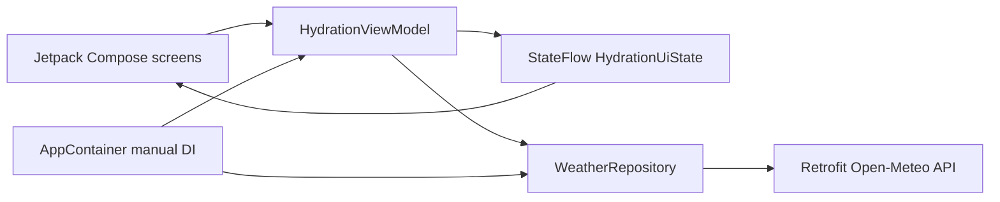

# HydroCheck

<p align="center">
  
</p>

HydroCheck is an Android hydration utility app developed for **CP3406 Assignment 1**. It gives users focused, at-a-glance information about today's water intake, remaining hydration target, live weather adjustment, and suggested next drink.

The app is designed so that a user can open the Home screen, understand their current hydration status, and record a drink within a few seconds.

## Core Features

- Record water intake using several quick-add amounts.
- Calculate a daily goal from activity level and live temperature.
- Fetch current temperature data for Singapore, Cairns, or Brisbane.
- Explain clearly how activity and weather affect today's goal.
- Display remaining intake, completion percentage, and suggested next drink.
- Change city, activity level, preferred cup size, and temperature unit.
- Review today's individual drink entries and daily totals.
- Reset today's intake automatically when a new date is detected.
- Continue supporting hydration tracking if the weather request fails.

## Hydration Goal Rules

The selected activity level provides the base daily goal:

| Activity level | Base goal |
|---|---:|
| Low | 2000 ml |
| Medium | 2500 ml |
| High | 3000 ml |

Live temperature may then adjust the goal:

| Current temperature | Weather adjustment |
|---|---:|
| Below 24 C | No adjustment |
| 24 C to below 30 C | +250 ml |
| 30 C or above | +500 ml |

The Home and Insights screens show the resulting goal and explain the adjustment to the user.

## Screens

- **Home:** Live weather, today's intake, adjusted goal, remaining water, quick-add actions, and concise recommendations.
- **Insights:** Completion percentage, remaining intake, suggested next drink, and goal calculation.
- **History:** A lazy-loaded list of today's drink entries and daily totals.
- **Settings:** City, activity level, preferred cup size, and temperature-unit options that immediately update the app.

## Architecture

HydroCheck uses a small layered architecture that separates Compose UI, state management, and remote data access.



### Architecture Decisions

- **Jetpack Compose and Material 3** provide reusable, declarative UI components.
- **StateFlow** exposes immutable UI state from the ViewModel.
- **`collectAsStateWithLifecycle()`** keeps Compose state collection lifecycle-aware.
- **HydrationViewModel** owns hydration state and processes user actions.
- **Typed enum models** prevent invalid city, activity, cup-size, and temperature-unit values.
- **WeatherRepository** keeps Retrofit and network models outside UI logic.
- **Manual dependency injection** creates and supplies the repository through `AppContainer`.
- **LazyColumn** efficiently renders a growing hydration history.
- **Loading, success, and error states** keep the UI usable during network requests.

## Project Structure

```text
app/src/main/java/com/example/cp3406assignment1_utilityapp/
|-- MainActivity.kt                 App scaffold and bottom navigation
|-- HydrationViewModel.kt           StateFlow state and user actions
|-- HydroCheckApplication.kt        Manual dependency injection container
|-- CommonComponents.kt             Shared Compose components
|-- HydrationScreen.kt              Home screen
|-- InsightsScreen.kt               Hydration insights
|-- HistoryScreen.kt                Lazy-loaded history
|-- SettingsScreen.kt               User preferences
|-- model/HydrationModels.kt        Typed models and hydration calculations
|-- data/remote/OpenMeteoApi.kt     Retrofit API definition
|-- data/repository/WeatherRepository.kt
`-- ui/theme/                       Compose colors, typography, and theme
```

## Web API

HydroCheck uses the free [Open-Meteo API](https://open-meteo.com/) to request the current `temperature_2m` value. Each supported city is represented by typed coordinates before being passed to the repository.

No API key is required. The app requests the Android `INTERNET` permission and provides a Retry action if weather data cannot be loaded.

## Technologies

- Kotlin
- Jetpack Compose
- Material Design 3
- ViewModel and StateFlow
- Lifecycle-aware state collection
- Repository pattern
- Manual dependency injection
- Retrofit with Gson converter
- Open-Meteo API
- JUnit
- Android Lint

## Build and Run

Requirements:

- Android Studio
- Android SDK 36
- Minimum supported Android version: API 24
- Internet connection for live weather

1. Clone the repository.
2. Open the project in Android Studio.
3. Allow Gradle Sync to complete.
4. Select the `app` run configuration and an emulator or Android device.
5. Run the app.

The weather card loads current data automatically when the app starts or when the selected city changes.

## Testing and Verification

The project includes:

- Repository tests using a fake API implementation.
- Hydration calculation tests covering goals, weather adjustments, progress, recommendations, and temperature conversion.
- Android instrumented context test.

Run the main verification tasks with:

```text
./gradlew testDebugUnitTest assembleDebug lintDebug
```

Current verification status:

- Unit tests: passing
- Debug APK build: passing
- Android Lint: 0 errors

## Current Limitations

- Hydration history and settings remain in memory only while the app process is running.
- The available city list is intentionally limited to Singapore, Cairns, and Brisbane.
- Live weather requires an internet connection.
- Hydration targets are simplified utility-app recommendations and are not medical advice.

## Assignment Notes

This project was created for **CP3406 Assignment 1: Utility App**. The Git history contains regular, focused commits that demonstrate development from the initial blank project through UI creation, ViewModel state management, API integration, architecture refinement, testing, and Compose improvements.

Settings persistence is not required by the assignment, so the current implementation intentionally keeps settings in ViewModel state.

## Attribution

- Weather data: [Open-Meteo](https://open-meteo.com/)
